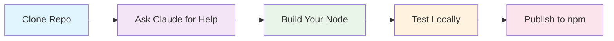

```
███╗   ██╗ █████╗ ███╗   ██╗     ███╗   ██╗ ██████╗ ██████╗ ███████╗███████╗
████╗  ██║██╔══██╗████╗  ██║     ████╗  ██║██╔═══██╗██╔══██╗██╔════╝██╔════╝
██╔██╗ ██║╚█████╔╝██╔██╗ ██║     ██╔██╗ ██║██║   ██║██║  ██║█████╗  ███████╗
██║╚██╗██║██╔══██╗██║╚██╗██║     ██║╚██╗██║██║   ██║██║  ██║██╔══╝  ╚════██║
██║ ╚████║╚█████╔╝██║ ╚████║     ██║ ╚████║╚██████╔╝██████╔╝███████╗███████║
╚═╝  ╚═══╝ ╚════╝ ╚═╝  ╚═══╝     ╚═╝  ╚═══╝ ╚═════╝ ╚═════╝ ╚══════╝╚══════╝
                                                                              
```

<div align="center">

**🚀 Professional Template for Building Custom n8n Nodes 🚀**

*Whether you're learning or building for production, this template provides everything you need to create high-quality, secure n8n nodes.*

[](https://choosealicense.com/licenses/mit/)
[](https://nodejs.org/)
[](https://n8n.io/)

</div>

---

## 🎯 **AI-Powered Development**

The secret weapon? **Ask Claude to read the docs in this repo and help you build nodes.**

```bash
# Just tell Claude:
"Hey Claude, read the documentation in the /docs folder and help me create 
a custom n8n node that connects to [whatever API/service you want]"
```

**Result:** Claude reads all the patterns and guides you through building professional-quality nodes.

---

## 📦 **What's Inside**

```
kens-custom-n8n-nodes/
├── 📁 docs/                    # Complete guides (8 comprehensive files)
├── 📁 nodes/                   # Your custom nodes go here
├── 📁 credentials/             # Authentication configurations  
├── 📁 scripts/                 # Publishing and release automation
├── ⚙️ package.json             # Node package configuration
├── 🔧 tsconfig.json            # TypeScript setup
└── 🏗️ gulpfile.js             # Build system
```

### **Core Features**
- ✨ **Complete template** for building custom n8n nodes
- 📚 **8 comprehensive guides** covering everything
- 🛡️ **Production-grade patterns** with security best practices
- 🤖 **LLM-optimized** - designed for Claude to read and understand
- 🔒 **Security-first** approach to prevent vulnerabilities

---

## ⚡ **Quick Start**

### **1. Clone & Setup**
```bash
# Clone the template
git clone https://github.com/KenKaiii/kens-custom-n8n-nodes.git my-awesome-nodes
cd my-awesome-nodes

# Install dependencies
npm install

# Test build
npm run build
```

### **2. Get n8n Running**
```bash
# Install n8n globally
npm install -g n8n

# Start n8n with tunnel
n8n start --tunnel
```

🌐 **n8n will open at:** `http://localhost:5678`

---

## 🧠 **Development Approaches**

<table>
<tr>
<td width="50%">

### **🤖 AI-Assisted (Recommended)**
1. **Ask Claude for help**
2. **Specify your needs:**
   - "Connect to Stripe API"
   - "Process CSV files"
   - "Send Discord messages"
   - "Call OpenAI API"

</td>
<td width="50%">

### **📖 Manual Development**
1. **Read capabilities guide first**
2. **Follow development patterns**
3. **Use testing & debugging docs**
4. **Apply security best practices**

</td>
</tr>
</table>

---

## 📚 **Documentation Library**

> **All guides located in `/docs/` folder**

| 📄 **Guide** | 🎯 **Purpose** |
|-------------|----------------|
| **capabilities-and-limitations.md** | What you CAN and CAN'T do *(start here!)* |
| **node-development-guide.md** | Step-by-step development patterns |
| **testing-and-debugging.md** | Local testing and troubleshooting |
| **publishing-guide.md** | npm publishing workflow |
| **security-best-practices.md** | Prevent security vulnerabilities |
| **troubleshooting.md** | Common issues and solutions |
| **advanced-patterns.md** | Multi-input nodes, AI routing, protocols |

---

## 🛠️ **Build Capabilities**

<details>
<summary><strong>📡 API Integration Nodes</strong></summary>

- REST API wrappers with authentication
- GraphQL integrations  
- Webhook processors
- Rate-limited API clients

</details>

<details>
<summary><strong>🔄 Data Transformation Nodes</strong></summary>

- JSON processors and validators
- Data formatting and cleaning
- Conditional routing
- Aggregation operations

</details>

<details>
<summary><strong>🤖 AI/LLM Nodes</strong></summary>

- Multi-model AI processors
- Intelligent content routing
- Context-aware processing
- Cost optimization patterns

</details>

<details>
<summary><strong>🛡️ Utility & Security Nodes</strong></summary>

- Protocol implementations
- State management systems
- Performance monitoring
- Security scanners

</details>

### **⚠️ Technical Limitations**
```diff
- File system operations (security risk)
- System command execution (dangerous)  
- Long-running background processes (not n8n's design)
- Complex state management (nodes are stateless)
```

---

## 🎯 **Quick Start Workflow**



1. **Clone this repository**
2. **Ask Claude:** *"Read the n8n docs in `/docs` and help me build a [whatever] node"*
3. **Follow Claude's guidance** - it reads the patterns and helps you
4. **Test locally** using `n8n start --tunnel`
5. **Publish to npm** when ready

---

## ⚙️ **Template Specifications**

### **✅ This Template Provides:**
- Complete foundation for n8n development
- Production-ready patterns and security practices  
- AI-assisted development optimization
- Real-world complexity examples

### **❌ This Template Doesn't:**
- Include ready-to-use business nodes
- Replace n8n's official documentation
- Guarantee compatibility with every edge case

---

## 🆘 **Getting Help**

| 🤖 **AI Assistant** | 📖 **Documentation** | 🛠️ **Development** |
|---------------------|----------------------|---------------------|
| Use Claude with docs | Check troubleshooting guide | Start with simple API connector |
| Specify exact needs | Read limitations first | Test locally before publishing |

---

## 🏆 **Why This Template**

> *"Existing n8n node tutorials often lack depth and real-world patterns."*

**This template delivers:**
- **Real patterns** from production nodes
- **Honest limitations** - what works vs what doesn't  
- **Security practices** - prevent common vulnerabilities
- **LLM optimization** - perfect for AI-assisted development

---

<div align="center">

### **Ready to Build Something Amazing?**

**Clone • Ask Claude • Build • Ship**

---

**Created by [Ken Kai](https://youtube.com/@kenkaidoesai)**

*Share your creations - let's see what you build!*

</div>